## 1. 프로젝트 개요

터미널에서 동작하는 4지선다 퀴즈 프로그램입니다.
사용자는 메뉴를 통해 퀴즈를 풀거나 새 퀴즈를 등록하거나 최고 점수를 확인할 수 있습니다.
퀴즈 데이터와 최고 점수는 `state.json`에 저장되어 프로그램을 껐다 켜도 유지됩니다.

- 개발 언어: Python 3

## 2. 퀴즈 주제 선정 이유

퀴즈 주제로 "파이썬 기초 문법"을 선택했습니다.

이번 과제의 목적이 파이썬 문법과 객체지향 구조를 익히는 것이기때문에
퀴즈 내용 자체도 학습 중인 내용으로 구성하면 문제를 만드는 과정에서
도움이 될것같다고 판단했습니다.

## 3. 실행 방법

```bash
git clone https://github.com/Imjunho90/Quiz
cd quiz
python codyssey.py
```

첫 실행 시 `state.json`이 없으면 기본 퀴즈 13문제가 자동 생성됩니다.
종료는 메뉴에서 `5`를 입력하거나 `Ctrl+C`를 누르면 됩니다.

## 4. 기능 목록

| 메뉴 | 기능 | 설명 |
|---|---|---|
| 1 | 퀴즈 풀기 | 저장된 퀴즈를 순서대로 출제하고 정답당 10점을 부여합니다. 종료 시 정답 수와 총점을 표시하고 최고 점수를 갱신하면 저장합니다. |
| 2 | 퀴즈 추가하기 | 문제, 보기 4개, 정답 번호를 입력받아 새 퀴즈를 등록하고 파일에 저장합니다. |
| 3 | 퀴즈 목록 보기 | 등록된 퀴즈의 문제 목록을 번호와 함께 출력합니다. |
| 4 | 최고 점수 보기 | 저장된 최고 점수를 확인합니다. 기록이 없으면 안내 메시지를 출력합니다. |
| 5 | 퀴즈 삭제하기 | 등록된 퀴즈의 문제 목록을 번호와 함께 출력하고 그 목록 중에 삭제할 번호를 입력합니다.|
| 6 | 종료 | 프로그램을 종료합니다. 키 인터럽트로 종료시 비정상 종료가 아닌 데이터 저장 후 안전하게 종료됩니다.|


## 5. 파일 구조

```text
Quiz/
├── main.py              # 메인 모듈 실행
├── Quiz.py              # 질문, 보기, 정답, 힌트를 정리하는 class
├── Quiz_game.py         # 퀴즈 풀기, 목록 보기, 점수 보기 등 메인 기능이 있는 클래스
├── GameRecord.py        # 플레이 했던 게임 날짜, 점수 , 총 문제수를 기록하는 클래스
├── state.json           # 데이터 파일 저장과 로드에 쓰이는 json 데이터
├── history.json         # 점수 기록 관리에 쓰이는 json 데이터
├── .gitignore
├── README.md
└── img/
    ├── add.png
    ├── damaged.png
    ├── delete_quiz.png
    ├── except.png
    ├── KeyboardInterrupt.png
    ├── menu.png
    ├── quit.png
    ├── quiz.png
    ├── restart.png
    ├── score_screen.png
    └── show_score_screen.png
```


## 6. 클래스 구조

- Quiz — 개별 퀴즈 한 문제를 표현
  - 속성: question, choices, answer
  - 메서드: show_quiz(), is_correct(), to_dict()

- QuizGame — 게임 전체 관리
  - 속성: quizzes, high_score, filename
  - 메서드: run(), start_quiz(), add_quiz()
    show_list(), show_score(),
    load_data(), save_data() default_data(),
    save_history(),load_history()
    get_valid_value(), delete_quiz()

- GameRecord - 게임 기록 시간, 게임 수, 점수 관리
  - 속성: date, total, score
  - 메써드: to_dict()

- main - 게임 실행

### Quiz.py

| method | function |
|---|---|
| show_quiz()| 퀴즈 목록 출력|
|is_correct()| 플레이어의 답변이 정답인지 확인|
|to_dict()|속성들을 json 형식으로 변환|

### QuizGame.py

|method|function|
|---|---|
|run()|퀴즈 프로그램 시작시 보이는 메뉴|
|start_quiz()|플레이어가 퀴즈를 푸는 모듈|
|add_quiz()|플레이어가 퀴즈를 추가하는 모듈|
|show_list()|프로그램에 로드된 퀴즈 목록 출력|
|show_score()|프로그램에 로드된 최고 점수 출력|
|load_data()|프로그램 시작시 데이터 로드|
|save_data()|프로그램에서 사용되는 데이터 저장|
|default_data()|기본 데이터 로드, 프로그램에서 사용될 데이터가 없거나 손상시에 대체|
|save_history()|플레이어가 플레이한 퀴즈 플레이 히스토리 저장|
|load_history()|플레이어가 플레이한 퀴즈 플레이 히스토리 로드|
|get_valid_value()|플레이어가 프로그램내에서 입력할 시에 데이터 타입과 범위를 검증|
|delete_quiz()|프로그램에 로드된 퀴즈 목록을 삭제|

### GameRecord.py

|method|function|
|---|---|
|to_dict()|속성들을 json 형식으로 변환|


## 7. 데이터 파일 설명

### 7-1. state.json
프로젝트 루트에 UTF-8 인코딩으로 저장됩니다.

```json
{
    "high_score": 0,
    "quizzes": [
        {
            "question": "파이썬에서 리스트에 요소를 추가하는 함수는?",
            "choices": [
                "add()",
                "append()",
                "insert()",
                "push()"
            ],
            "answer": 2,
            "hint": "리스트의 끝에 요소를 추가할 때 사용합니다."
        }
    ]
}
```


| 키 | 타입 | 설명 |
|---|---|---|
| `high_score` | int | 최고 점수 (정답 1개당 10점) |
| `quizzes` | list | 퀴즈 객체 목록 |
| `quizzes[].question` | str | 문제 |
| `quizzes[].choices` | list[str] | 보기 4개 |
| `quizzes[].answer` | int | 정답 번호 (1~4) |
| `quizzes[].hint` | str | 힌트 |


저장 시점

- 첫 실행으로 기본 데이터를 생성했을 때
- 새 퀴즈를 추가했을 때
- 최고 점수를 갱신했을 때
- `Ctrl+C` 등으로 중단되었을 때


복구 동작

파일이 없으면 기본 퀴즈 5문제를 생성하고, JSON 형식이 깨졌거나
퀴즈 목록이 비어 있으면 안내 메시지 출력 후 기본 데이터로 초기화합니다.

### 7-2. history.json

```json
[
  {
    "date": "2026-08-11 17:52:06",
    "total": 3,
    "score": 30
  }
]
```

| 키 | 타입 | 설명 |
|---|---|---|
| `date` | string | 퀴즈를 실행한 날짜와 시간 |
| `total` | int | 전체 문제 수 |
| `score` | int | 획득 점수 |


## 8. 프로그램 실행 화면

### 8-1 menu
프로그램 실행시 state.json가 없으면 dafault data를 불러와 게임을 시작합니다.
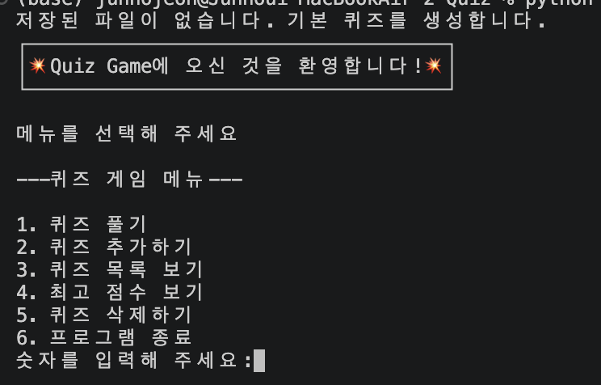

### 8-2 quiz
퀴즈 풀기 메뉴(1)을 누르면 몇 문제를 풀지 입력하는 칸이 나오고 만약 문제에 힌트가 있다면 힌트를 볼지 안볼지 y or n중에 선택하면됩니다.
만약 퀴즈 힌트를 본다면 기본점수에서 -5를한 점수를 받고 힌트를 보고도 틀린다면 -5점 감점을 당합니다.
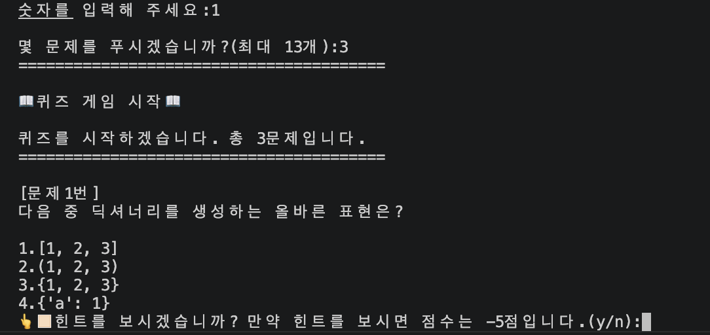

문제를 다 풀면 본인의 점수가 나오고 만약 본인의 점수가 최고 기록을 세웠다면 이 게임에서의 최고기록이 갱신이 됩니다.
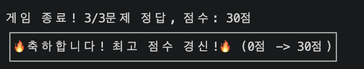

### 8-3 add
퀴즈 추가 메뉴(2)를 누르면 질문, 보기(1~4), 정답, 힌트를 입력할 수 있고 
만약 힌트를 추가하기 싫다면 n을 누르면 되고 원한다면 y를 누르고 힌트를 입력해 주면됩니다.
y,Y,N,n 이외의 모든 문자를 입력하게 된다면 다시 입력하라는 상태창이 뜹니다.
추가된 퀴즈는 state.json에 업데이트 됩니다.
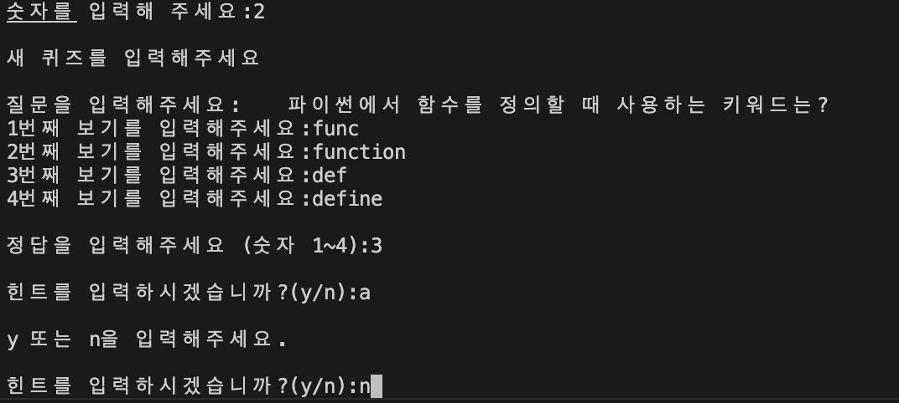

### 8-4 list
최고 점수 보기 메뉴(3)를 누르면 현재 로드된 모든 퀴즈 데이터들의 목록이 나옵니다.
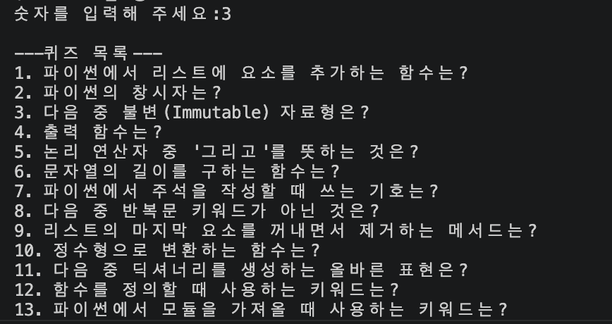

### 8-5 show_score
최고 점수 보기 메뉴(4)를 누르면 현재 최고 점수와 플레이를 했던 시간, 문제수, 점수가 순서대로 출력이 되고 
이중 최고 점수 기록이 표시됩니다.
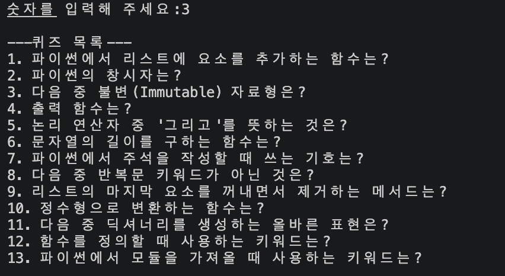

### 8-6 delete_quiz
퀴즈 삭제 메뉴(5)를 누르면 현재 로드된 모든 퀴즈 데이터 목록이 나오고
이 문제들 중에 삭제하고싶은 번호를 입력합니다.
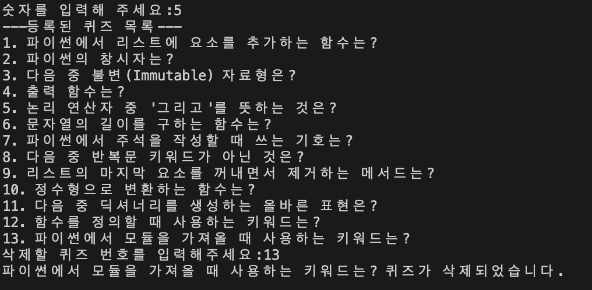

### 8-7 quit
프로그램 종료(6)을 누르면 프로그램이 종료됩니다.
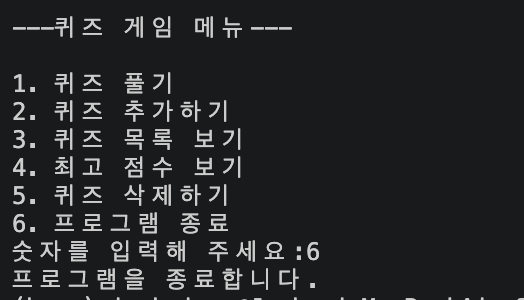

### 8-8 except
아래 케이스들의 입력의 경우 경고 후 재입력하는 흐름으로 돌아갑니다.
1. 숫자가 아닌 문자 입력
2. 빈 입력값
3. 범위 밖의 숫자 입력

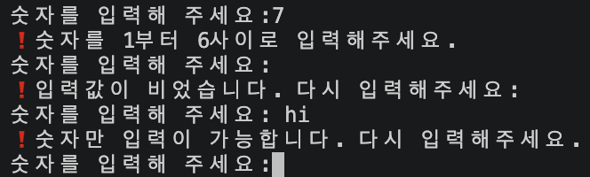

프로그램 실행 중 Ctrl+C 입력이 발생했을 경우 비정상 종료가 아닌 안내 메시지를 출력하고
데이터를 저장 후 안전하게 종료합니다.

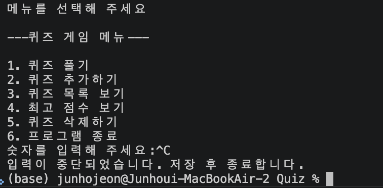

state.json 데이터가 손상됬을 경우에도 프로그램이 비정상적으로 종료되지않고 기본 퀴즈를 재생성합니다.
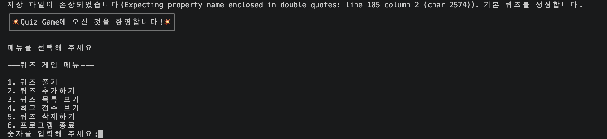

프로그램 종료 후 재 실행시 데이터가 유지됩니다.
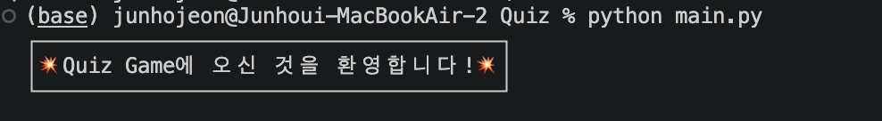

git

## 9. git log

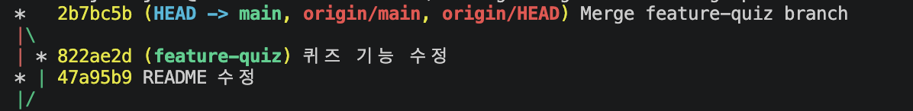
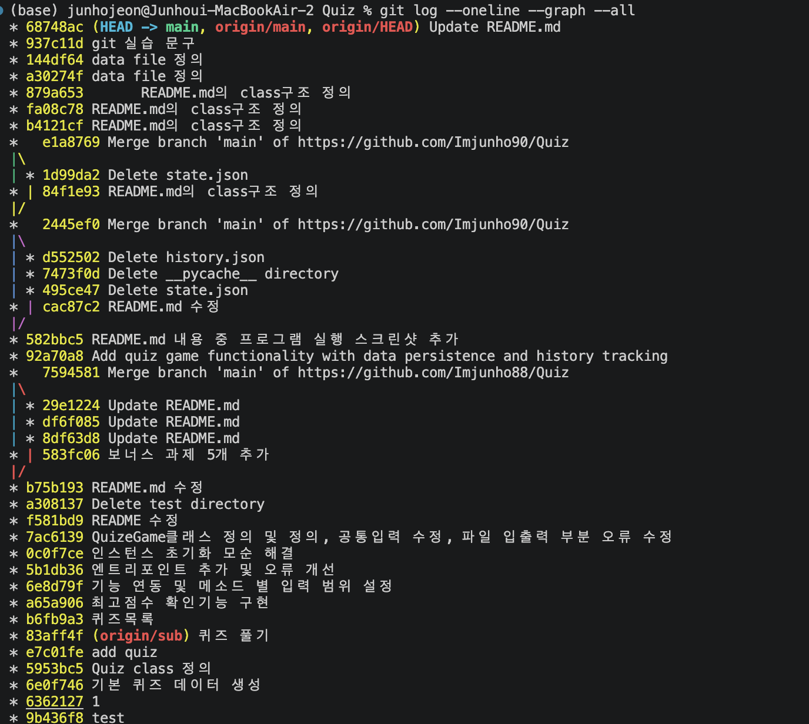

sub1에서 퀴즈모듈을 만들고 main으로 브랜치 병합을 진행하였습니다.


## 10. 개발 환경

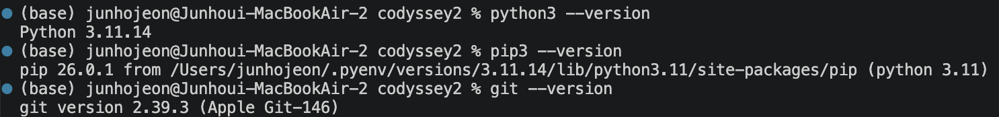


## 11. clone과 pull 실습

프로그램 완성후 레포지토리를 복제하였습니다.
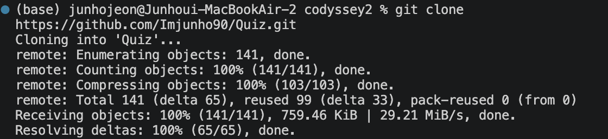

그 후 다른 로컬에서 README.md 수정 후 현재 로컬에서 git pull을 하여 변경사항을 가져왔습니다.
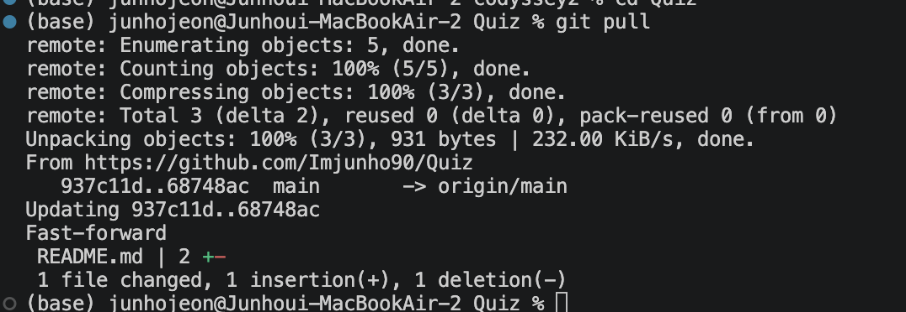
ss
